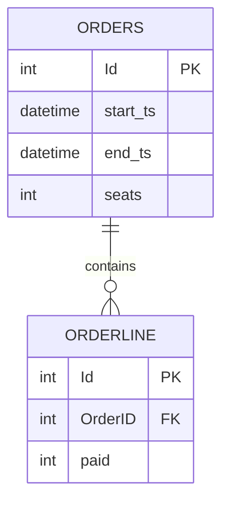
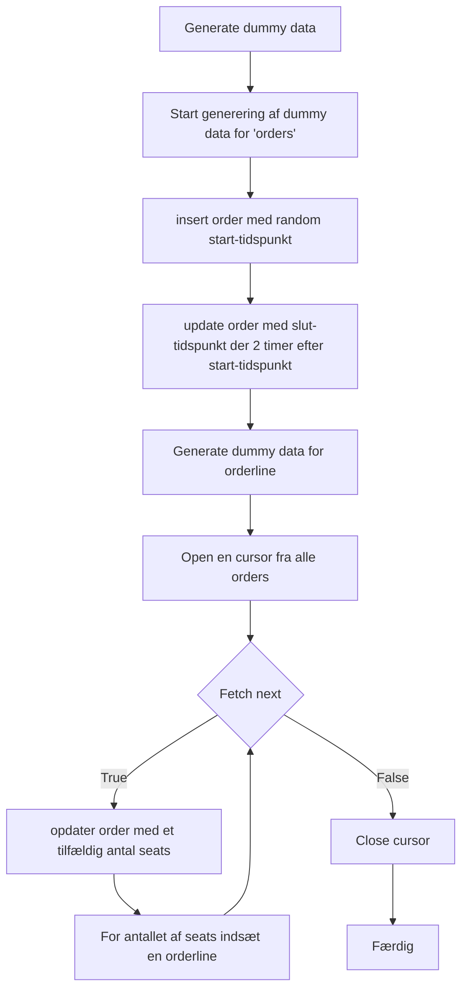

# POC for Generering af Dummy Data i MSSQL

## Formål
Formålet med dette proof of concept (POC) er at demonstrere, hvordan man kan generere dummy data til testning i en MSSQL-database. Dette kan være nyttigt i udviklings- og testmiljøer, hvor der er behov for realistiske datasæt til at validere funktionaliteten af databaser og applikationer.

## Tabeller og Relationen
I denne POC oprettes to tabeller: `orders` og `orderline`. Tabellen `orders` repræsenterer en ordre, mens `orderline` repræsenterer individuelle linjer inden for en ordre. En ordre kan indeholde flere linjer.

## Proces Flowchart for Generering af Dummy Data

Nedenfor er en flowchart, der beskriver processen for generering af dummy data til `orders` og `orderline` tabellerne:

## Anvendelse
Ved at køre dette script, oprettes de nødvendige tabeller og der genereres dummy data. Denne data kan bruges til at teste forespørgsler, datavalidering, performance, og andre aspekter af databaseoperationer i en sikker testmiljø.

